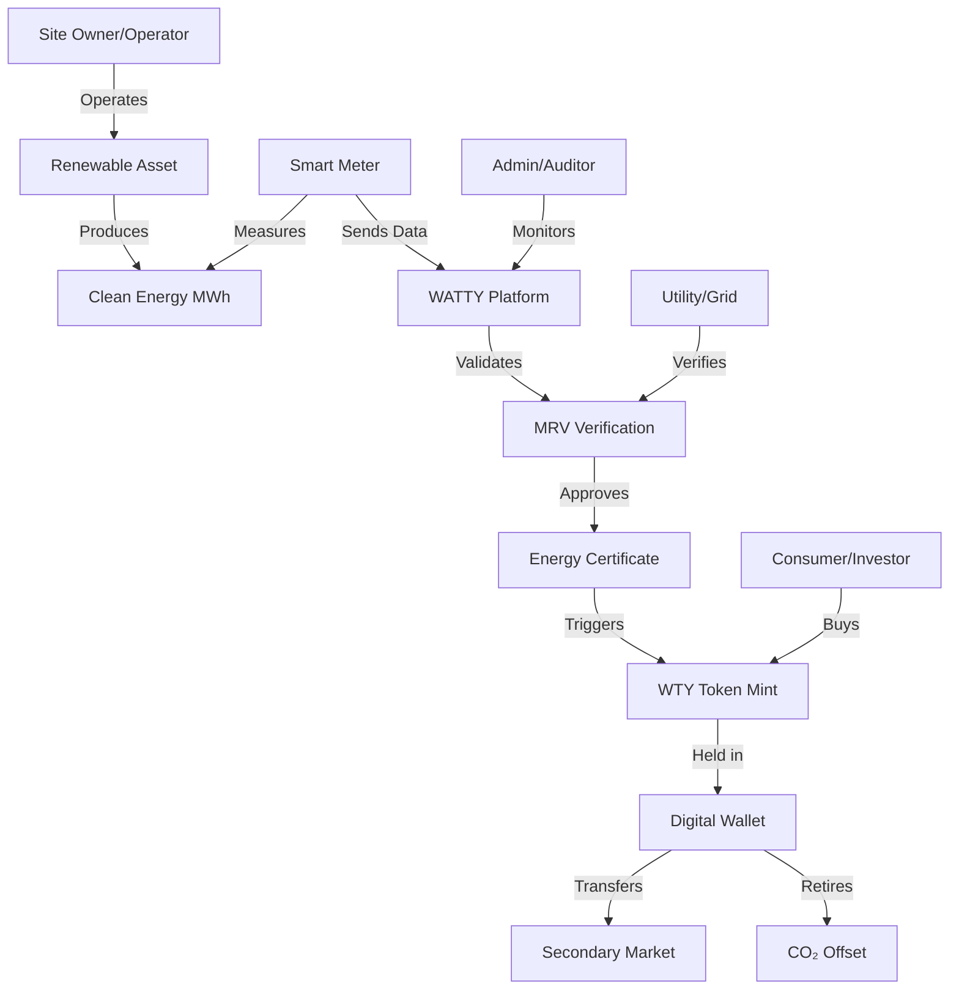

# System Context: Energy and Tokenization Events

## 1. Energy Events

An **energy event** is an immutable, time-bound record that represents a fact about energy production or the transformation of energy data within the MRV (Monitoring, Reporting, and Verification) lifecycle. All energy events ultimately relate to a measurable quantity of energy (MWh).

### 1.1 Meter Reading
A direct measurement produced by a physical or virtual meter.

- Represents energy measured over a time interval
- Unit: kWh or MWh
- Source of physical truth

**Example**
- Meter `M-001` reports `0.27 MWh` at `2026-03-01T10:15Z`

### 1.2 Delta (Net) Energy
A derived energy quantity calculated from meter readings over a defined period.

- Computed as the sum or difference of meter readings
- May include corrections, losses, or exclusions
- Unit: MWh
- Scoped to an asset and time window

**Example**
- Asset `A-01` net energy: `1,234.56 MWh` for March 2026

### 1.3 Tariff Window (Not an Energy Event)
Tariff windows provide **pricing context** for energy but do not represent energy quantities themselves.

**Not energy events**
- Tariff windows
- Prices or carbon curves
- CO₂ calculations
- Certificate minting, transfer, or retirement
- Financial or commercial actions

---

## 2. Tokenization Events

A **tokenization event** is a lifecycle event that creates, moves, or permanently consumes digital representations of certified energy within the ledger.

Tokenization events only occur after energy has been verified and certified.

### 2.1 Tokenization Event Types

#### 2.1.1 Mint / Issue
- Occurs when a certificate is issued
- Converts certified MWh into minted units (N) using the BP13 methodology
- Creates the initial ledger balance

#### 2.1.2 Transfer
- Changes ownership of certificates or batches
- Quantities are conserved; no recalculation occurs

#### 2.1.3 Split / Merge
- Reorganizes batches for allocation or settlement
- Conserves total quantities

#### 2.1.4 Retire (Burn)
- Permanently consumes units for claims or offsetting
- Irreversible; removes units from circulation

---

## 3. Actors

### 3.1 Site Owner / Operator
- Owns or operates energy-producing assets
- Provides access to meters and telemetry
- Primary recipient of certificates and revenue

### 3.2 Consumer / Tenant
- End user of energy or purchaser of certificates
- May retire certificates to substantiate energy or climate claims

### 3.3 Utility / Settlement Party
- Provides grid data, settlement references, or reconciliation inputs
- Acts as an external verification or reference source

### 3.4 Admin / Auditor
- Governs emission factors, methodologies, and approvals
- Reviews MRV data, certificates, ledger integrity, and audit packs
- Cannot alter issued certificate payloads or fabricate energy

### 3.5 Device Identity (Meter)
- Physical or virtual measurement device
- Identified by device ID, manufacturer, serial number, and optional certificate
- Produces signed or hash-linked readings to support data integrity

# System's flow diagram

